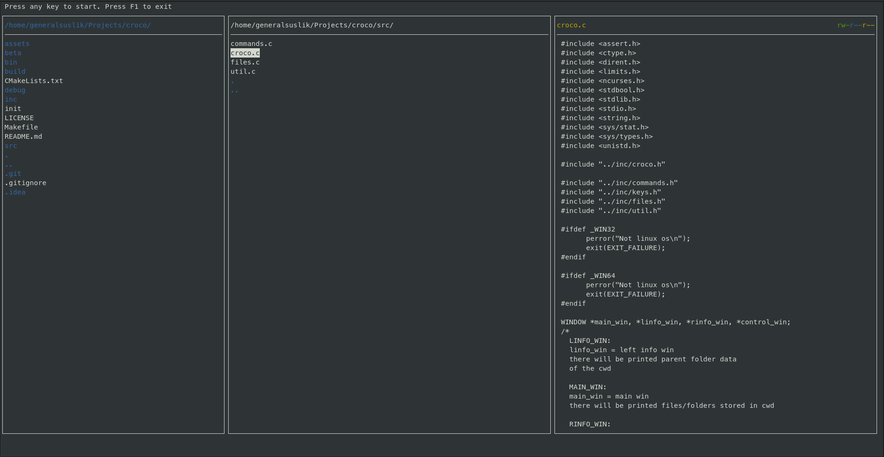

<div align="center">
	
</div>

## croco - 🐊Efficient terminal file manager  

<div align="center">
	
</div>
<div align="center">
	
</div>

## Installation
🖥️ Start script for smart installation:
```bash
./init
```
Or you can just make it 🤓
```bash
make && make run
```
But make sure, that required packages installed\
Required packages:
* `ncurses`

## Controls
* Arrow keys or h-j-k-l to navigate through dirs
* Press "Enter" to open the file / enter the directory / execute the command
* commands:
	* run croco app
		* Run from /home/<username> directory
		```bash
		./croco 
		```
		* Run from your current directory
		```bash
		./croco .
		```
	* add file/folder
		```
		:a <file>
		```
		```
		:a <folder>/
		```
	* remove file/folder
		```
		:r <file>
		```
		```
		:r <folder>/
		```
	* exit
		* exit from integrated command line
			```
			:q
			```
		* exit with pressing F1 button on your keyboard

	

